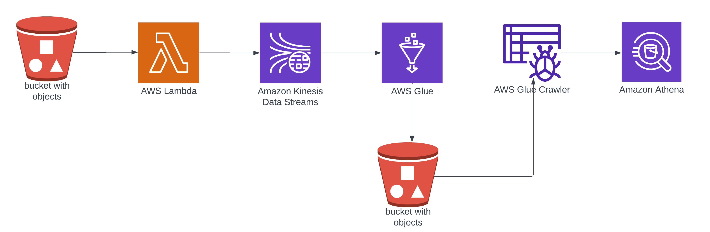

# Mobile Network Data Processing with AWS Cloud Services

This project leverages AWS cloud services to transform real-time mobile network data for insightful analytics. The workflow involves uploading CSV files to Amazon S3, which triggers a Lambda function to put records into a Kinesis DataStream. Subsequently, a Glue job implemented with PySpark consumes the stream, aggregates, and transforms the data, enabling comprehensive mobile network analytics based on parameters such as signal strength, GPS accuracy, and operator performance. 

## Requirements

Before using this project, ensure you meet the following requirements:

- **Prior working knowledge of AWS cloud and services**
- **Prior programming experience in Python and PySpark**
- **Basic understanding of streaming concepts using PySpark**

## Workflow Overview

1. **Upload CSV Files to S3**: Users upload CSV files containing mobile network data to an S3 bucket.
2. **Lambda Trigger**: Upon file upload, a Lambda function is triggered, putting the records into a Kinesis DataStream.
3. **Glue Job Processing**: A Glue job implemented with PySpark consumes the Kinesis DataStream, performing aggregation and transformation tasks on the data.
4. **Analytics**: Processed data allows for insightful mobile network analytics, facilitating analysis on signal strength, GPS accuracy, operator performance, and more.
5. **Store Processed Data in S3**: Processed data is stored back in an S3 bucket for further access and analysis.
6. **AWS Glue Crawler**: A Glue Crawler is run to automatically discover the schema of the processed data and maintain the metadata catalog.
7. **Querying with Athena**: Users can use Amazon Athena to execute SQL queries on the processed data, gaining valuable insights and generating reports.

## Technologies Used

- **AWS Lambda**: Handles the triggering mechanism for processing data.
- **Amazon S3**: Acts as the storage medium for uploaded CSV files and processed data.
- **Amazon Kinesis DataStream**: Facilitates real-time data streaming for efficient processing.
- **AWS Glue**: Executes the ETL (Extract, Transform, Load) process using PySpark for data transformation and runs the Glue Crawler for metadata catalog maintenance.
- **Amazon Athena**: Enables querying of processed data using SQL syntax for analytics and reporting.

## Getting Started

To get started with this project, follow these steps:

1. Clone the repository.
2. Set up an AWS account if you haven't already.
3. Configure AWS services according to the provided instructions.
4. Upload your mobile network data CSV files to the designated S3 bucket.
5. Monitor the processing and analytics using AWS services and tools.
6. Leverage Athena for querying processed data and generating reports.

## Contributions and Issues

Contributions and feedback are welcome! If you encounter any issues or have suggestions for improvements, please feel free to raise them in the GitHub repository's issue tracker.

## License

This project is licensed under the [MIT License](LICENSE). Feel free to modify and distribute it as per your requirements.

--- 
